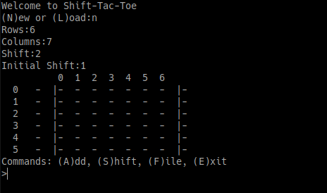

# ShiftTacToe
A generalized implementation of Shift-Tac-Toe in Python with a GUI (PySimpleGUI) and command line interface to the library. Allows arbitrary rows, columns, pieces, shifting spaces. To play the actual Shift-Tac-Toe game from 1988 (https://boardgamegeek.com/boardgame/23318/shift-tac-toe), the board needs to be changed to have dimensions 3 x 3 with a shift of 2 and initial shift of 1. The GUI and cmd line versions have a save and load function. They can be used with each other, but it may cause an error. Currently, the GUI saves the color of the piece as the piece in the grid, which will cause issues if the value is not a color.

## ShiftTacToe library
The main library is ShiftTacToe.py. It is not set up as a game, and thus there are no functions to determine a 'win' condition.

## ShiftTacToe GUI
The gui is built with PySimpleGUI (https://www.pysimplegui.org). The default board size and interface is shown below as well as screenshots with a larger board. For really large boards, or just for space, the options side panel can be hidden via the top menu.

These demonstrate a few features such as custom cell size, the board grid width, custom colors, and changing the board. It is important to note that the top section deletes the current board while the bottom options are non-destructive.

## ShiftTacToe Command Line Interface
The interface is basic and was created simply to test out some features and for debugging.

